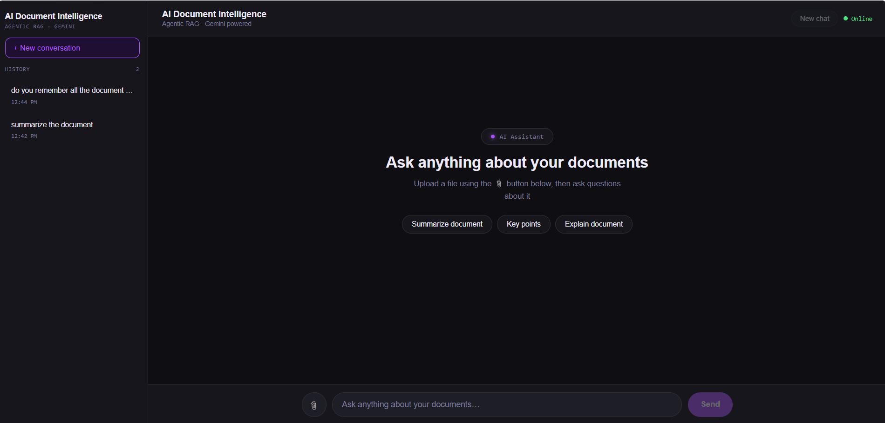
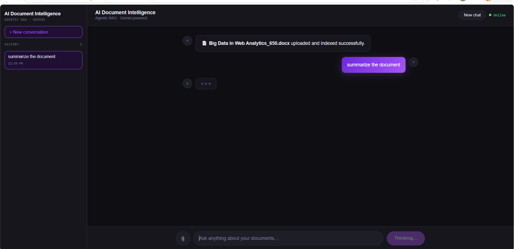
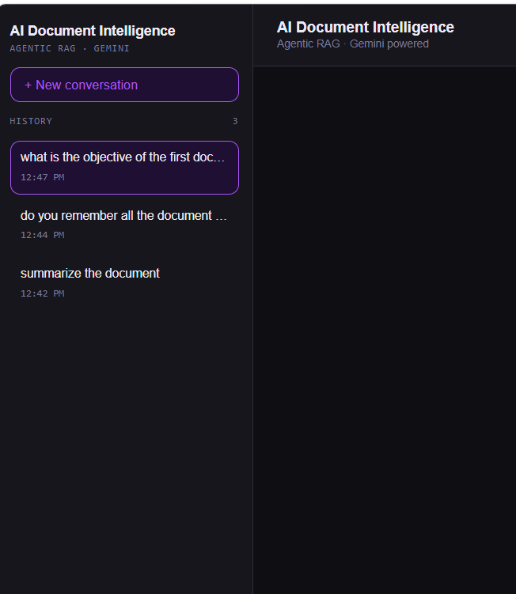

# AI Document Intelligence Platform

An agentic RAG-powered document intelligence system. Upload documents and interact with them using natural language.

**Live Demo:**
- Frontend: https://ai-document-intelligence-platform-nine.vercel.app
- Backend API: https://ai-document-intelligence-platform-hit4.onrender.com

## Screenshots

### Home Screen

### Uploading a Document

### Asking Questions and Getting Answers

### Conversation History Sidebar

## Features

- Multi-format upload: PDF, DOCX, TXT, MD, CSV
- Duplicate upload protection
- Conversation memory
- Source citations with text snippets
- Conversation history sidebar
- Mobile responsive
- Render free tier cold-start handling

## Tech Stack

- Frontend: React.js
- Backend: Python, FastAPI
- LLM: Google Gemini 2.5 Flash
- Embeddings: Google Gemini Embedding 001
- RAG: LangChain, LangGraph
- Vector Store: ChromaDB
- Deployment: Vercel and Render

## Run Locally

### Backend
cd backend
python -m venv venv
venv\Scripts\activate
pip install -r requirements.txt

Create .env file:
GOOGLE_API_KEY=your_key_here

uvicorn main:app --reload

### Frontend
cd frontend
npm install
npm start

## Environment Variables

- GOOGLE_API_KEY - Backend .env
- REACT_APP_API_URL - Frontend .env and Vercel

## Author

**RimLee Deka** - AI Engineer and Full Stack Developer
