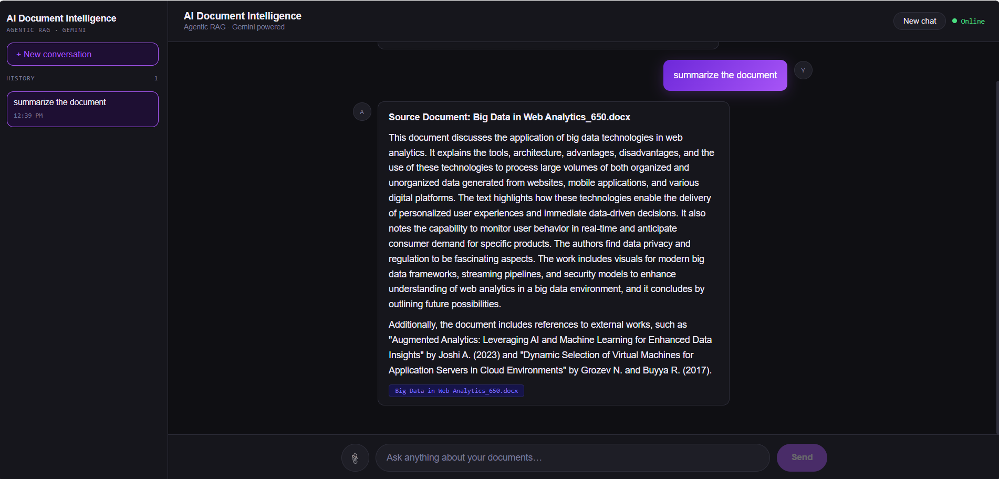

# AI Document Intelligence Platform

An agentic RAG-powered document intelligence system. Upload documents and interact with them using natural language — the AI answers questions based only on your document content, with source citations for every response.

**Live Demo:**
- Frontend:https://ai-document-intelligence-platform-nine.vercel.app/
- Backend API: https://ai-document-intelligence-platform-hit4.onrender.com

---

## Features

**Multi-format Document Upload**
Upload PDF, DOCX, TXT, MD, or CSV files via drag-and-drop or the file picker. Documents are automatically chunked, embedded, and indexed into ChromaDB. Re-uploading the same file replaces the old version instead of creating duplicates.

**Conversational AI with Memory**
Ask questions in natural language. The assistant remembers previous messages in the conversation, so follow-up questions work naturally. Answers are grounded strictly in your uploaded documents — the model will not hallucinate or use outside knowledge.

**Source Citations**
Every AI response shows which document(s) it pulled from, with a clickable snippet showing the exact text chunk retrieved.

**Conversation History**
Past conversations are saved in the sidebar. Switch between them, start new ones, or delete old ones at any time.

**Production-ready Architecture**
- Render free tier cold-start handling (auto-retry with status updates)
- Duplicate document deduplication in ChromaDB
- Proper HTTP error codes and user-facing error messages
- Fully responsive — works on mobile and desktop

---

## Tech Stack

| Layer | Technology |
|---|---|
| Frontend | React.js, CSS |
| Backend | Python, FastAPI, Uvicorn |
| LLM | Google Gemini 2.5 Flash |
| Embeddings | Google Gemini Embedding 001 |
| RAG Pipeline | LangChain, LangGraph |
| Vector Store | ChromaDB |
| Document Loaders | PyPDFLoader, Docx2txt, TextLoader, CSVLoader |
| Deployment | Vercel (frontend), Render (backend) |

---

## Architecture

```
User Question + Conversation History
              │
              ▼
      LangGraph Workflow
              │
       ┌──────┴──────┐
       ▼             │
   Retriever         │
       │             │
       ▼             │
 ChromaDB Search     │
       │             │
       ▼             │
 Top-3 Relevant      │
 Document Chunks     │
       │             │
       └──────┬──────┘
              ▼
   Google Gemini 2.5 Flash
   (context + history + rules)
              │
              ▼
   Answer + Source Citations
```

---

## Project Structure

```
ai-document-intelligence-platform/
│
├── frontend/
│   └── src/
│       ├── App.js
│       ├── App.css
│       ├── Chat.js          # Main chat UI with history, upload, citations
│       └── chat.css         # Dark theme, neon purple, responsive
│
├── backend/
│   ├── main.py              # FastAPI routes: /chat, /upload, /documents
│   ├── ingest.py            # Multi-format ingestion + deduplication
│   ├── rag_graph.py         # LangGraph RAG pipeline with memory
│   ├── retriever.py
│   ├── data/                # Default documents
│   ├── uploads/             # User-uploaded files
│   ├── chroma_db/           # Persisted vector store
│   └── requirements.txt
│
└── README.md
```

---

## API Endpoints

### `GET /`
Health check.
```json
{ "message": "AI Document Intelligence Platform API is running 🚀" }
```

### `POST /upload`
Upload and index a document.
- Accepts: `.pdf`, `.docx`, `.txt`, `.md`, `.csv`
- Re-uploading the same filename replaces the existing indexed version

### `POST /chat`
Ask a question with optional conversation history.
```json
{
  "question": "What are the key responsibilities?",
  "history": [
    { "sender": "user", "text": "Summarize this document" },
    { "sender": "ai", "text": "This document covers..." }
  ]
}
```
Response:
```json
{
  "answer": "The key responsibilities include...",
  "sources": [
    { "source": "resume.pdf", "snippet": "Led backend architecture..." }
  ]
}
```

### `GET /documents`
List all currently indexed document filenames.
```json
{ "documents": ["resume.pdf", "handbook.docx"] }
```

---

## Running Locally

### Backend

```bash
cd backend
python -m venv venv
venv\Scripts\activate        # Windows
# source venv/bin/activate   # Mac/Linux

pip install -r requirements.txt
```

Create a `.env` file:
```
GOOGLE_API_KEY=your_google_api_key_here
```

Start the backend:
```bash
uvicorn main:app --reload
```
Runs at `http://localhost:8000`

### Frontend

```bash
cd frontend
npm install
```

Create a `.env` file:
```
REACT_APP_API_URL=http://localhost:8000
```

Start the frontend:
```bash
npm start
```
Runs at `http://localhost:3000`

---

## Environment Variables

| Variable | Where | Description |
|---|---|---|
| `GOOGLE_API_KEY` | Backend `.env` | Google AI Studio API key |
| `REACT_APP_API_URL` | Frontend `.env` / Vercel | Backend base URL |

---

## What's Been Built

✅ Multi-format document upload (PDF, DOCX, TXT, MD, CSV)  
✅ Duplicate upload protection — re-upload replaces, not duplicates  
✅ Conversation memory — follow-up questions work naturally  
✅ Source citations with text snippets on every answer  
✅ Conversation history sidebar with load/delete  
✅ Render free tier cold-start handling with auto-retry  
✅ Mobile responsive UI  
✅ Proper HTTP error codes and user-facing error messages  
✅ Environment variable based config (no hardcoded URLs)  

---

## Screenshots

### Home Screen


### Uploading a Document


### Asking Questions & Getting Answers


### Conversation History Sidebar


---

## Author

**RimLee Deka** — AI Engineer | Python Developer | Full Stack Developer

---

*Built with React, FastAPI, LangGraph, Gemini, and ChromaDB*
